# ML, DL, NLP & GenAI — Basic Notes

---

## 📚 Course / Learning Roadmap

1. ML Basics and Use Cases
2. ML → DL → NLP
3. Traditional AI vs Generative AI
4. Evolution of LLMs
5. Deployment Basics
6. Chatbot Project

### Overall Learning Flow

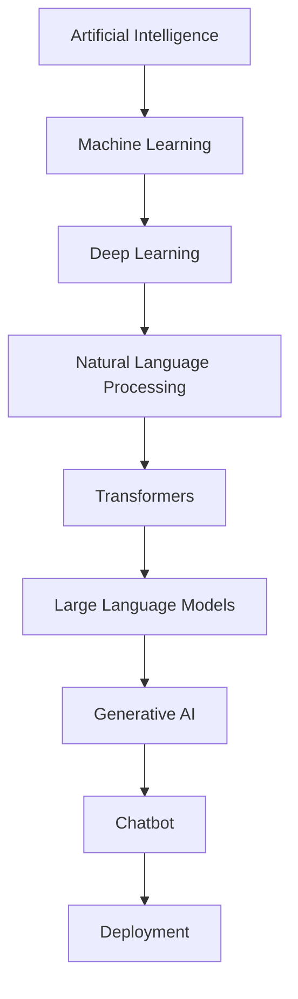

> **Important:** This is a simplified learning roadmap, not a strict hierarchy. NLP is a field concerned with human language, while Deep Learning is a major approach used in modern NLP systems.

---

# 1. ML BASICS AND USE CASES

## What is Machine Learning?

**ML = Machine Learning**

Machine Learning is a branch of Artificial Intelligence where a machine learns patterns from data and uses those learned patterns to make predictions or decisions.

Instead of explicitly programming every rule:

```text
INPUT
  ↓
Manually Written Rules
  ↓
OUTPUT
```

Machine Learning uses:

```text
DATA + EXPECTED OUTPUT
          ↓
       TRAINING
          ↓
        MODEL
          ↓
  PREDICTION / OUTPUT
```

---

# 1.1 Important ML Terms

## 1. Feature

A **feature** is an input variable used by the model to make a prediction.

### Example — House Price Prediction

Features could be:

* Square feet
* Number of bathrooms
* BHK
* Pin code
* Location

Think:

```text
FEATURE = INPUT
```

---

## 2. Label

A **label** is the known/correct output associated with a training example.

Example:

```text
House:

sq_ft       = 1200
bathrooms   = 2
pin_code    = 713130

Actual price = ₹50 lakh
```

Here:

```text
Price = Label
```

---

## 3. Target

The **target** is the value that the model is trying to predict.

For example:

```text
Features:
    sq_ft
    bathrooms
    pin_code

Target:
    flat price
```

### Simple Understanding

```text
Feature → Input

Target  → Output we want to predict
```

> **Note:** "Label" and "target" are closely related terms. For beginner-level understanding, you can think of the feature as the input and target/label as the expected output.

---

## 4. Dataset

A **dataset** is a collection of data/examples used for Machine Learning.

Example:

| sq_ft | bathrooms | pin_code | price |
| ----: | --------: | -------: | ----: |
|  1000 |         2 |   713130 |   40L |
|  1200 |         2 |   713130 |   48L |
|  1500 |         3 |   713130 |   65L |

The complete collection is called a **dataset**.

---

## 5. Model

A **model** is the learned representation created during training.

The model learns relationships between:

```text
FEATURES
   ↓
MODEL
   ↓
TARGET / PREDICTION
```

---

## 6. Weight / Parameter

**Weights/parameters** are values learned by the model during training.

They determine how strongly different inputs/features influence the prediction.

### Simple Mathematical Example

```text
y = mx + c
```

Where:

```text
x → feature / input
y → prediction
m → weight
c → bias / intercept
```

With multiple features:

```text
y = a*x1 + b*x2 + c
```

For example:

```text
x1 → square feet
x2 → number of bathrooms

a → weight of square-feet feature
b → weight of bathroom feature
c → bias/intercept
```

The model learns suitable parameter values during training.

---

# 1.2 House / Flat Price Example

Suppose we want to predict the price of a flat.

### Features

```text
sq_ft
number of bathrooms
BHK
pin code
```

### Target

```text
flat price
```

Example:

```text
Features:

sq_ft       = 1200
bathrooms   = 2
pin_code    = 713130

Target:

price       = ₹50 lakh
```

We provide many such examples to the model.

The model tries to learn:

> **How does the target change when the features change?**

For example:

```text
More square feet
       ↓
Usually higher price
```

```text
More bathrooms
       ↓
May affect price
```

```text
Different pin code
       ↓
May affect price
```

The model does not simply memorize one rule.

It learns patterns/relationships from many training examples.

---

# 1.3 Training

**Training** is the process of showing training data to a model so that the model can learn patterns and adjust its parameters/weights.

### Simple Flow

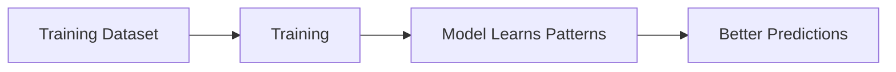

In simple classroom language:

> Model ko dataset dikhate hain aur uske parameters/weights ko adjust karte hain taaki prediction expected value ke kareeb aaye. Is process ko **training** bolte hain.

The model learns from the training data by repeatedly processing examples and updating its parameters according to the learning algorithm.

---

# 1.4 Testing

**Testing** means checking whether the trained model performs well on data that it did not use for learning.

### Simple idea

```text
TRAINING
   ↓
Learn

TESTING
   ↓
Check how well it learned
```

Example:

```text
Training Data:

House A
House B
House C
House D

        ↓
     Training
        ↓
   Trained Model
        ↓
     House E
        ↓
     Prediction
```

House E was not used during training.

We compare:

```text
Model Prediction
       VS
Actual Value
```

---

# 1.5 Inference

**Inference** is the process of using a trained model to make a prediction on new/unseen input data.

### Flow

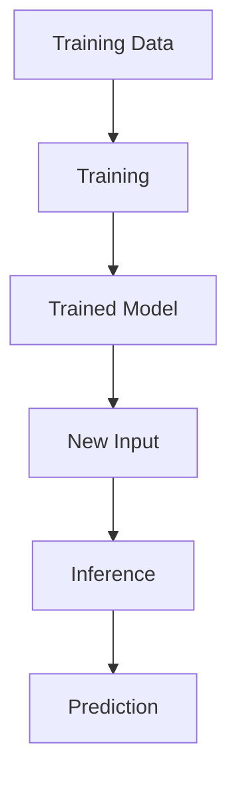

Example:

The model has already been trained.

Now a user gives:

```text
sq_ft       = 1500
bathrooms   = 3
pin_code    = 713130
```

The trained model predicts:

```text
price = ₹65 lakh
```

This prediction process is called **Inference**.

---

# 1.6 Scikit-learn

**scikit-learn (`sklearn`)** is a popular Python Machine Learning library.

It provides implementations of many traditional ML algorithms and tools for:

* Training models
* Testing/evaluation
* Data preprocessing
* Regression
* Classification
* Clustering
* Model selection

Simple idea:

```text
Python
  ↓
scikit-learn
  ↓
ML Algorithms
  ↓
Train Model
```

We do not need to implement every traditional ML algorithm from mathematical equations ourselves.

---

# 1.7 Main ML Types / Use Cases

For this GenAI learning path, remember these major ML problem types:

1. Regression
2. Classification
3. Clustering
4. Recommendation

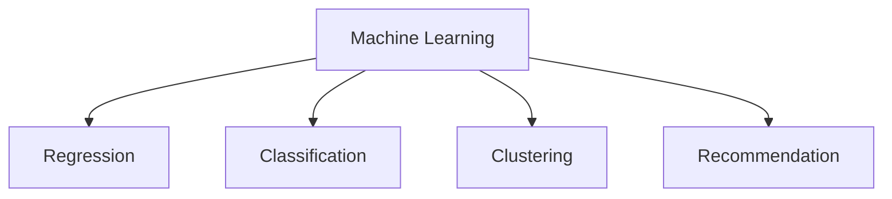

---

# 1.7.1 Regression

**Regression** is used when the model needs to predict a numerical value.

### Examples

* House price
* Temperature
* Salary
* Sales
* Numerical measurements

Example:

```text
Features
   ↓
ML Model
   ↓
₹45.5 lakh
```

Possible outputs:

```text
45.5 lakh
52.2 lakh
71.8 lakh
```

These are numerical/continuous values.

### Remember

```text
REGRESSION → NUMBER
```

---

# 1.7.2 Classification

**Classification** is used when the model needs to predict a category/class.

### Examples

```text
Yes / No

Pass / Fail

Spam / Not Spam

Good / Neutral / Bad

Cat / Dog
```

Example:

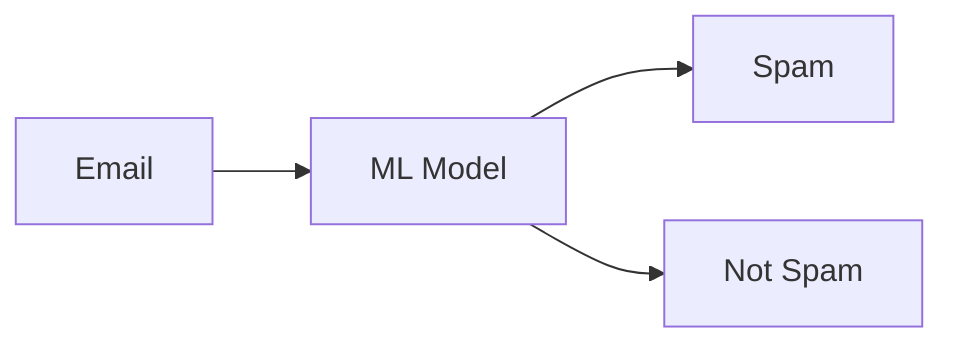

The output is a **class/category**.

### Remember

```text
CLASSIFICATION → CLASS / CATEGORY
```

---

# 1.7.3 Clustering

**Clustering** groups similar data points together.

The algorithm looks for patterns/similarity in the data and creates groups.

```text
Similar Data Points
        ↓
     Same Group
        ↓
      Cluster
```

### Example

Suppose a platform has information about users:

```text
User A → likes sports
User B → likes sports

User C → likes movies
User D → likes movies

User E → likes technology
```

An algorithm may find groups of users with similar behavior.

### Remember

```text
CLUSTERING → GROUP SIMILAR DATA
```

> **Note:** Clustering is different from classification because clustering does not require predefined class labels in the same way supervised classification does.

---

# 1.7.4 Recommendation

A **recommendation system** suggests items that a user may be interested in.

### Examples

* Instagram → Posts/Reels
* YouTube → Videos
* Netflix → Movies/Shows
* Amazon → Products
* Spotify → Songs

Example:

```text
User watches:

Python
ML
GenAI
   ↓
Recommendation System
   ↓
May recommend:
More AI / Python / ML content
```

Recommendation systems can use several techniques, including similarity-based and machine-learning approaches.

### Remember

```text
RECOMMENDATION
       ↓
What should we show the user?
```

---

# 1.8 ML Mind Map

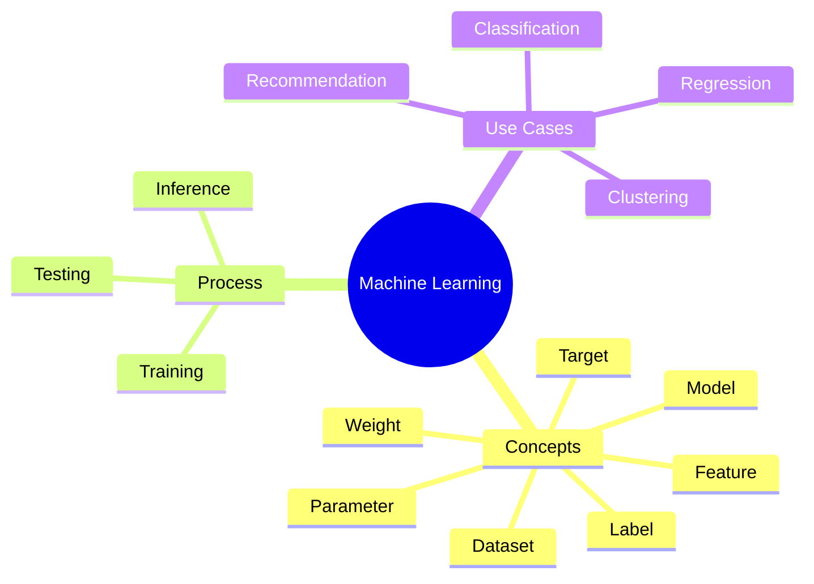

---

# 2. ML → DL → NLP

Now we move from basic ML toward Deep Learning and NLP.

### Simplified Learning Flow

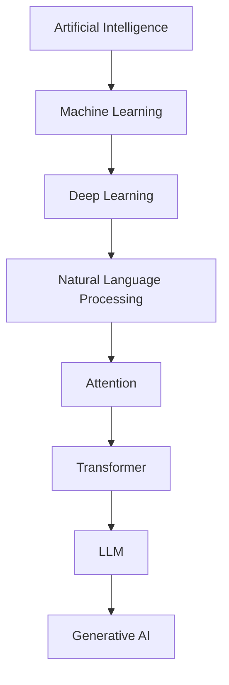

> **Important:** This is a simplified learning roadmap, not a strict hierarchy. NLP is a field focused on human language, while Deep Learning is a major approach used in modern NLP.

---

# 2.1 Simple ML Problem

Suppose we want to predict flat price.

### Features

```text
1. Square feet
2. Number of bathrooms
3. BHK
4. Pin code
```

Suppose we have around 4 useful features.

We can visualize relationships such as:

```text
Square Feet vs Price

Price
  |
  |             *
  |          *
  |       *
  |    *
  | *
  +----------------------> Square Feet
```

Or:

```text
BHK vs Price

Price
  |
  |                 *
  |            *
  |       *
  |   *
  +----------------------> BHK
```

A simple relationship may sometimes be approximated using a linear equation:

```text
y = mx + c
```

With multiple features:

```text
y = w1*x1 + w2*x2 + w3*x3 + ... + b
```

For relatively simple relationships, traditional ML algorithms can work very well.

---

# 2.2 When the Number of Features Becomes Large

Now imagine:

```text
4 features
      ↓
20 features
```

And the relationship between the features and target is highly **non-linear**.

For example:

```text
Feature 1
Feature 2
Feature 3
   .
   .
Feature 20
   ↓
Complex relationship
   ↓
Target
```

A simple equation may not be sufficient to capture the relationship.

This is where **Deep Learning** becomes important.

---

# 2.3 Linear vs Non-Linear Relationship

## Linear Relationship

A simple linear relationship can be represented as:

```text
y = mx + c
```

Conceptually:

```text
Target
  |
  |          *
  |       *
  |    *
  | *
  +----------------------> Feature
```

The relationship can be approximated by a straight line.

---

## Non-Linear Relationship

Real-world problems can contain complex relationships.

For example:

```text
Feature 1
Feature 2
Feature 3
...
Feature 20
      ↓
Complex interactions
      ↓
Target
```

When many features interact in complicated ways, simple ML models may not be sufficient for the problem.

Deep Learning can learn complex non-linear relationships using multiple layers of neural networks.

---

# 2.4 Example — Cancer Detection

Consider a simplified medical classification problem.

Suppose the input contains many features:

```text
Feature 1
Feature 2
Feature 3
...
Feature 20
```

Target:

```text
Cancer
  |
  +---- Yes
  |
  +---- No
```

The relationship between many medical features and the target can be complex and non-linear.

Deep-learning models can learn complex patterns from such data.

> **Important:** This is only a conceptual example. Real medical ML systems require carefully collected clinical data, validation, appropriate metrics, and much more than simply adding features to a model.

---

# 2.5 Why Deep Learning?

Traditional ML can perform very well for many structured-data problems.

However, some problems involve:

* Very high-dimensional data
* Complex non-linear relationships
* Images
* Audio
* Text
* Very large datasets

Deep Learning uses **neural networks with multiple layers**.

### Simple Structure

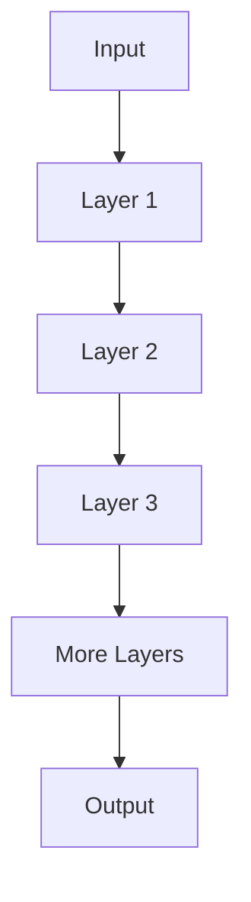

These layers can learn increasingly complex representations from data.

This is why it is called:

> **Deep Learning**

---

# 2.6 NIFTY 50 vs Time Example

Another classroom example:

```text
NIFTY 50 vs TIME
```

Conceptually:

```text
NIFTY 50
   |
   |          *
   |     *       *
   |  *     *
   |       *
   | *
   +----------------------> Time
```

The relationship between time and market values can be complex.

This demonstrates that real-world data does not always follow a simple linear relationship.

> **Note:** Stock-market prediction is a difficult real-world problem and is not simply solved by using Deep Learning.

---

# 3. NLP

**NLP = Natural Language Processing**

NLP is a field of AI that focuses on enabling computers to process, understand, analyze, and generate human language.

### Examples

* Text classification
* Spam detection
* Autocomplete
* Autocorrect
* Sentiment analysis
* Translation
* Question answering
* Text generation

### Basic Idea

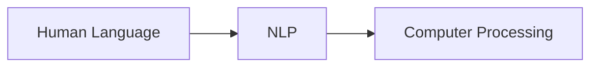

---

# 3.1 NLP Examples

## Autocomplete

Suppose a user types:

```text
"I am feeling..."
```

The system may suggest:

```text
happy
sad
good
tired
```

The system uses language patterns to predict possible next words or phrases.

---

## Autocorrect

User types:

```text
teh
```

System may suggest:

```text
the
```

---

## Spam Detection

Input:

```text
"Congratulations! You won a prize..."
```

Output:

```text
SPAM
```

This can be treated as a **classification problem**.

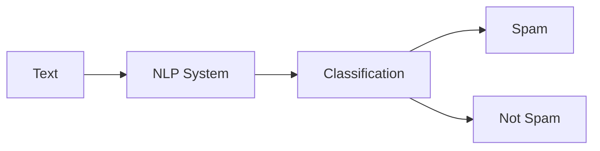

---

# 3.2 NLP → LLM

Traditional NLP systems were designed to solve specific language tasks.

As Deep Learning developed, increasingly powerful neural-network architectures were used for NLP.

A major milestone was the development of the **Transformer architecture**.

The Transformer architecture was introduced in the 2017 paper:

> **"Attention Is All You Need"**

Transformers became extremely important for modern language models.

### Simplified Evolution

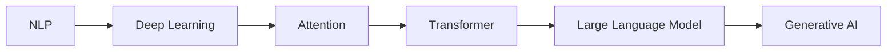

---

# 4. TRADITIONAL AI VS GENERATIVE AI

## Traditional AI

Traditional AI systems are often designed to perform a particular prediction, classification, decision, or task.

### Examples

* Spam detection
* Fraud detection
* Recommendation
* Image classification
* House-price prediction

The output is usually:

```text
Prediction
Classification
Score
Decision
```

---

## Generative AI

Generative AI refers to AI systems that can generate new content.

### Examples

* Text
* Images
* Audio
* Video
* Code

Example:

```text
User:

"Write a Python function to reverse a string."

          ↓

Generative AI

          ↓

Python Code
```

### Simple Comparison

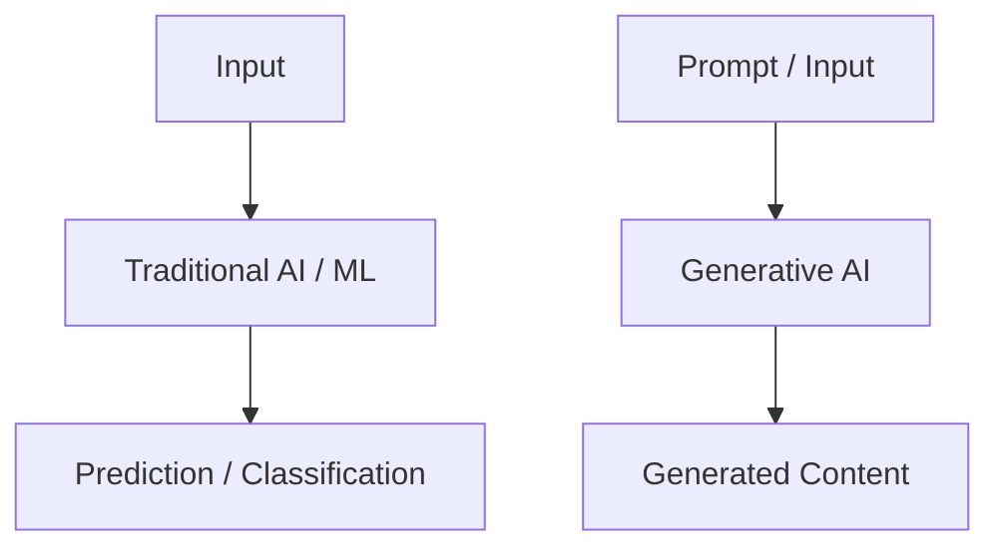

---

# 4.1 LLM and Generative AI

**LLM = Large Language Model**

An LLM is a large neural-network model trained on large amounts of data to learn patterns in language.

### LLM Applications

* Chatbots
* Coding assistants
* Question answering
* Summarization
* Text generation
* Document analysis

---

## LLM vs GenAI

They are related but not exactly the same.

### LLM

A type of model focused primarily on language.

### Generative AI

A broader category of AI systems that generate new content.

Examples:

```text
GenAI
  |
  +-- Text
  +-- Image
  +-- Audio
  +-- Video
  +-- Code
```

An LLM can be the core model behind a text-based GenAI application.

---

# 5. EVOLUTION OF LLMs

A simplified evolution:

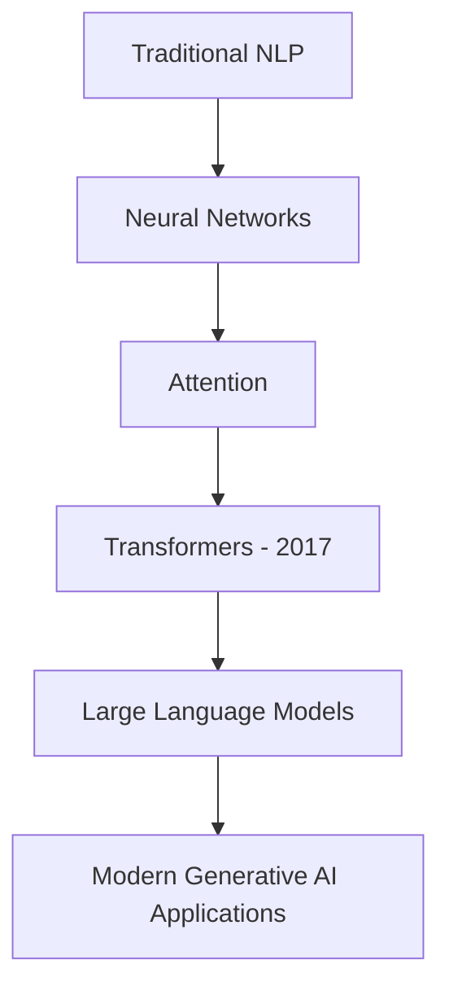

The Transformer architecture was a major turning point because attention mechanisms allowed models to better handle relationships between tokens in a sequence.

For now, we only need the basic evolution.

Detailed topics such as:

* Tokenization
* Embeddings
* Attention
* Self-Attention
* Encoder
* Decoder
* Transformer architecture

can be studied separately.

---

# 5.1 Why Did ChatGPT Appear Much Later?

A common question:

> If NLP and neural networks existed earlier, why did ChatGPT become widely available only in 2022?

Modern LLMs required several developments to come together:

1. Better neural-network architectures
2. Transformer architecture
3. Large-scale training datasets
4. Large numbers of model parameters
5. Powerful GPUs / compute infrastructure
6. Better training techniques
7. Instruction tuning / alignment techniques
8. Large-scale engineering and deployment

### Simple Idea

```text
Earlier NLP
     ↓
Better Neural Networks
     ↓
Attention
     ↓
Transformers
     ↓
Large-scale Training
     ↓
Large Language Models
     ↓
Modern GenAI Applications
```

---

# 5.2 Model Size / Parameters

A model contains **parameters**.

These parameters are learned during training.

Modern language models can contain millions, billions, or even larger numbers of parameters.

### Examples

```text
1M   = 1 Million

700M = 700 Million

7B   = 7 Billion

70B  = 70 Billion
```

### Important

> More parameters does **not automatically** mean a model is better.

Model architecture, training data, training method, quality, inference efficiency, and many other factors also matter.

For basic understanding:

```text
Larger Model
     ↓
Potentially greater capacity
     ↓
Usually requires more compute/resources
```

---

# 6. DEPLOYMENT BASICS

After building an ML/AI application, we need to make it available for users.

This process is broadly called **Deployment**.

### Development → Deployment

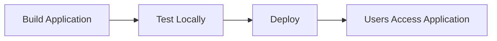

---

# 6.1 Local vs Deployed Application

## Local

Your application may run on:

```text
Your Computer
      ↓
localhost
      ↓
Local Environment
```

For example:

```text
http://localhost:8000
```

Normally, other internet users cannot directly access your localhost application.

---

## Deployed

A deployed application is hosted on infrastructure accessible to users.

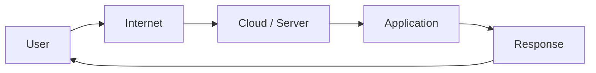

---

# 6.2 Basic AI Application Architecture

A basic GenAI application may contain:

1. Frontend
2. Backend / API
3. LLM / AI Model
4. Database
5. Vector Database
6. External APIs
7. Deployment Infrastructure

### Architecture

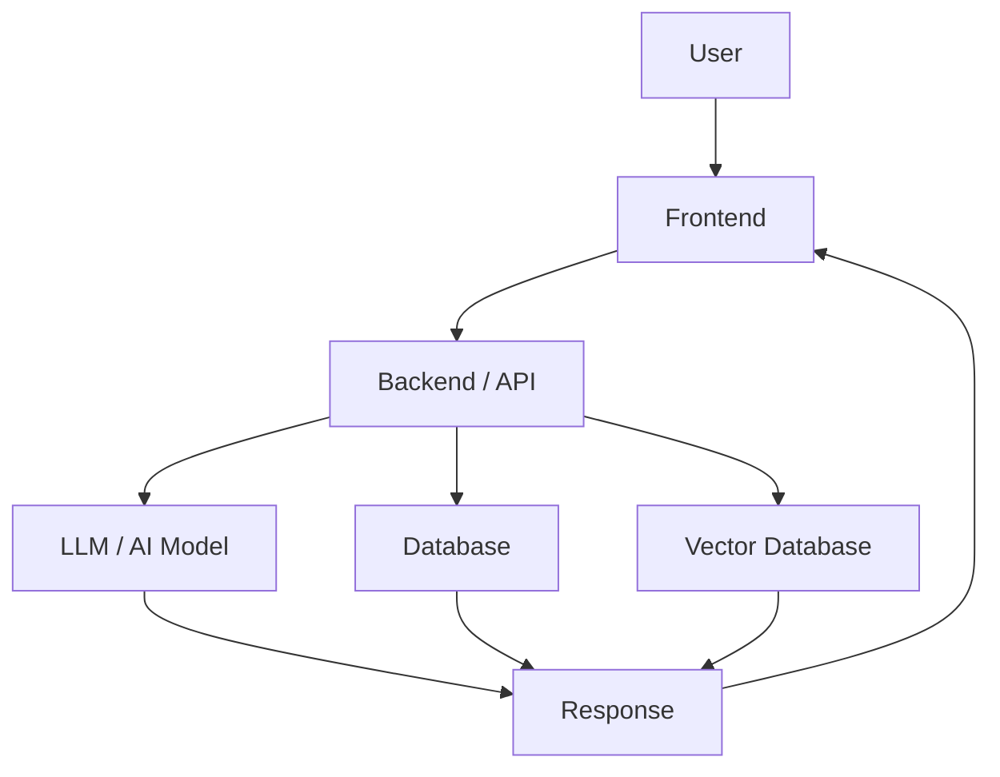

---

# 6.3 Technologies We May Encounter Later

Deployment may involve:

* Docker
* Cloud platforms
* APIs
* Web servers
* CI/CD
* Environment variables
* Databases

For now, remember only the basic concept:

```text
Build
  ↓
Test
  ↓
Deploy
  ↓
Users
```

---

# 7. CHATBOT PROJECT

The final goal of this learning path is to build a chatbot project.

## Basic Chatbot

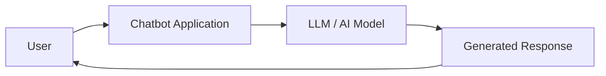

### Basic Flow

```text
USER
  ↓
Question / Prompt
  ↓
Chatbot Application
  ↓
LLM / AI Model
  ↓
Generated Response
  ↓
USER
```

---

# 7.1 Knowledge-Based / RAG Chatbot

For a knowledge-based chatbot, we may additionally use:

```text
Documents
    ↓
Chunking
    ↓
Embeddings
    ↓
Vector Database
    ↓
Retrieval
    ↓
LLM
    ↓
Grounded Answer
```

### RAG Flow

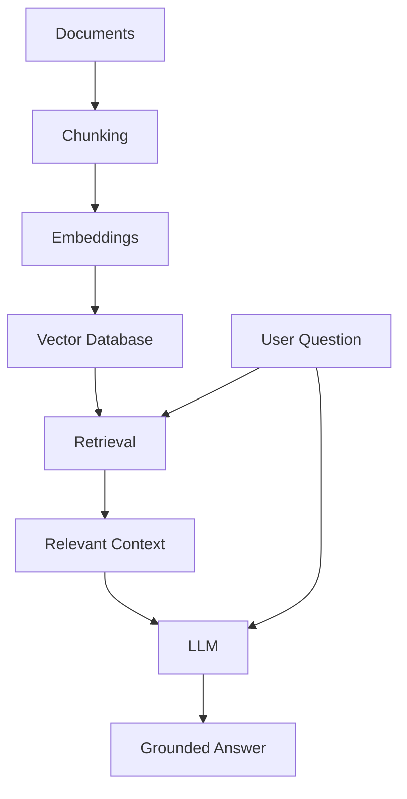

This is the basic idea behind a **RAG-based chatbot**.

---

# 8. COMPLETE MIND MAP

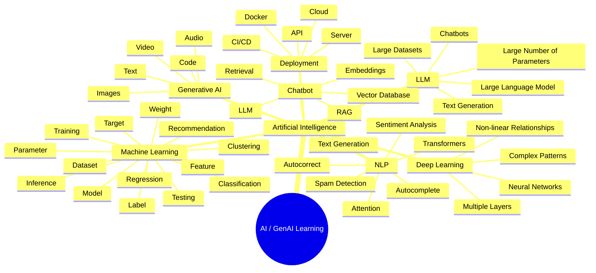

---

# 9. FINAL MEMORY MAP

```text
                         ARTIFICIAL INTELLIGENCE
                                  |
                                  v
                         MACHINE LEARNING
                                  |
             ---------------------------------------
             |            |          |             |
        Regression   Classification  Clustering  Recommendation
                                  |
                                  v
                         DEEP LEARNING
                                  |
                                  v
                                NLP
                                  |
                                  v
                              Attention
                                  |
                                  v
                            Transformer
                                  |
                                  v
                                LLM
                                  |
                                  v
                           Generative AI
                                  |
                    ----------------------------
                    |            |             |
                   Text        Code          Images
                    |
                    v
                 Chatbot
                    |
                    v
                Deployment
                    |
                    v
               Real Users
```

---

# 10. QUICK REVISION

| Term               | Simple Meaning                                          |
| ------------------ | ------------------------------------------------------- |
| **Feature**        | Input used by the model                                 |
| **Label**          | Known/correct output associated with training data      |
| **Target**         | Value the model tries to predict                        |
| **Dataset**        | Collection of examples/data                             |
| **Model**          | Learned representation used to make predictions/outputs |
| **Weight**         | Learned value influencing model behavior                |
| **Parameter**      | Learned value used by the model                         |
| **Training**       | Learning patterns from training data                    |
| **Testing**        | Evaluating the model on unseen test data                |
| **Inference**      | Using the trained model on new input                    |
| **Regression**     | Predicting a numerical value                            |
| **Classification** | Predicting a class/category                             |
| **Clustering**     | Grouping similar data points                            |
| **Recommendation** | Suggesting relevant items/content                       |
| **NLP**            | Processing human language                               |
| **LLM**            | Large Language Model                                    |
| **GenAI**          | AI capable of generating new content                    |
| **Deployment**     | Making an application/model available to users          |

---

# 11. MOST IMPORTANT CONCEPTS TO REMEMBER

### ML

```text
DATA
 ↓
TRAINING
 ↓
MODEL
 ↓
INFERENCE
 ↓
PREDICTION
```

### ML Problem Types

```text
Regression       → Number

Classification   → Class

Clustering       → Similar Groups

Recommendation   → What should we show the user?
```

### AI → GenAI Evolution

```text
AI
 ↓
ML
 ↓
DL
 ↓
NLP
 ↓
Attention
 ↓
Transformer
 ↓
LLM
 ↓
Generative AI
 ↓
Chatbot
 ↓
Deployment
```

### RAG Chatbot

```text
Documents
 ↓
Chunking
 ↓
Embeddings
 ↓
Vector Database
 ↓
Retrieval
 ↓
LLM
 ↓
Grounded Answer
```

---

# END OF ML, DL, NLP & GENAI BASIC NOTES
